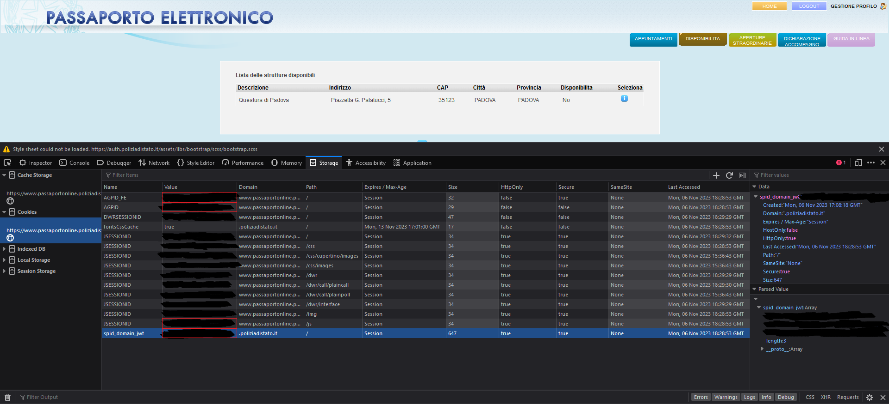

# Passport checker 

## What can this repository do? 
This python program is made to automatic check passport availability for a province in Italy.
Once passport is available for booking you will get notified with a Telegram message from a bot.

## Usage

1. Install Python from `https://www.python.org/downloads/` (if you don't already have)
2. Install requried dependencies with `pip install -r requirements.txt` in your virtualenv or wherever you want.
3. Create a telegram bot (check `https://core.telegram.org/bots#how-do-i-create-a-bot` for the simple guide). 
4. Before starting the bot you have to set all the environmental variables needed:
- `TOKEN`: get the token of the bot you've just created and assign it to this variable
- `PROVINCE`: the province you want to monitorate, in two capital letters form. 
- `AGPID_FE`: get this cookie value from your session once you logged in the portal `https://www.passaportonline.poliziadistato.it`
- `JSESSIONID`: get this cookie value from your session once you logged in the portal `https://www.passaportonline.poliziadistato.it`
- `AGPID`: get this cookie value from your session once you logged in the portal `https://www.passaportonline.poliziadistato.it`
- `SPID_DOMAIN_JWT`: get this cookie value from your session once you logged in the portal `https://www.passaportonline.poliziadistato.it`

You can have a more clear vision of what you have to set consulting the image below.

All the variables must be set as environmental variables or in the `.env` file.

5. Run bot with `python main.py`

